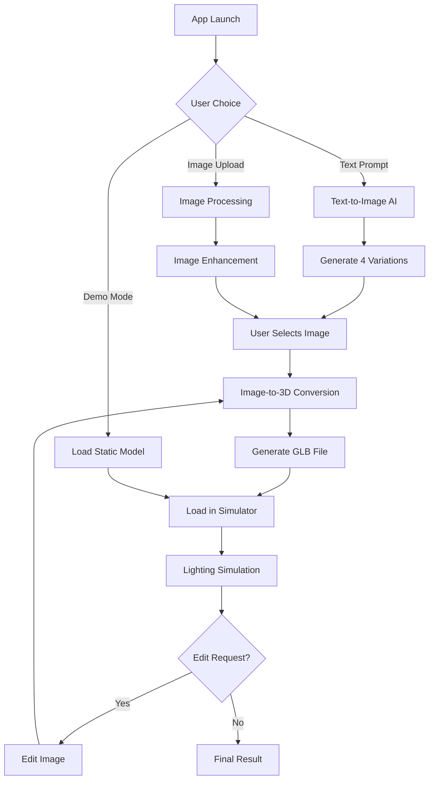

# AI-Powered 3D Lighting Simulation - Integration Plan

## Executive Summary

Transform the existing 3D lighting simulation app into an AI-powered platform where users can generate custom buildings/rooms through text or image prompts, then simulate lighting scenarios. The system leverages cutting-edge AI models for image generation and 3D reconstruction.

## Current State Analysis

### Existing Architecture
- **Frontend**: React + TypeScript + Vite
- **3D Engine**: Three.js with React Three Fiber
- **Features**:
  - IES lighting profiles support
  - GLTF/GLB model loading
  - Drag-and-drop fixture placement
  - Real-time lighting simulation
  - Scene manipulation tools
  - Project management system

### Key Components
1. `BuildingModel.tsx` - Loads and displays 3D models
2. `IESLight.tsx` - Handles realistic light distribution
3. `Scene.tsx` - Main 3D scene management
4. `LightingFixtures.tsx` - Fixture placement and management

## Proposed AI-Enhanced Flow



## Technology Stack & Services

### 1. Text/Image Generation
**Google Gemini 2.0 Flash** (Recommended)
- **Pros**: 
  - Native multimodal support (text + image understanding)
  - Excellent architectural/spatial understanding
  - Fast inference times
  - Google Cloud integration
- **API Access**: Via Google AI Studio or Vertex AI
- **Cost**: ~$0.00016 per 1K tokens

**Alternative**: Stability AI SDXL
- More control over image generation
- Open source options available

### 2. Image-to-3D Conversion

#### Commercial APIs (Recommended for Production)

**Meshy AI**
- **Pros**: High quality, REST API, GLB export
- **Pricing**: $0.20-0.50 per model
- **API**: Well-documented REST API
- **Quality**: Professional-grade outputs

**CSM (Common Sense Machines)**
- **Pros**: Fast processing, good architectural understanding
- **Pricing**: Subscription-based
- **Integration**: REST API with webhooks

**Kaedim**
- **Pros**: Artist-reviewed models, high quality
- **Pricing**: Enterprise pricing
- **Use Case**: Best for production apps

#### Open Source Solutions (Good for MVP)

**TripoSR (Stability AI)**
- **Pros**: Open source, runs locally
- **Quality**: Good for simple structures
- **Requirements**: GPU needed for local inference

**Zero123++ / StableZero123**
- **Pros**: Free via Hugging Face
- **Limitations**: Lower quality than commercial options

### 3. Model Processing & Optimization

**Draco Compression**
- Reduce GLB file sizes by 70-90%
- Maintain visual quality

**SimplifyModifier (Three.js)**
- Reduce polygon count for performance
- Essential for complex AI-generated models

## Implementation Architecture

### Phase 1: Core Infrastructure (Week 1-2)

```typescript
// src/services/ai/types.ts
interface AIGenerationRequest {
  type: 'text' | 'image';
  prompt?: string;
  image?: File;
  style: 'isometric' | 'realistic' | 'architectural';
}

interface AIGenerationResponse {
  images: string[]; // Base64 or URLs
  metadata: {
    generationTime: number;
    model: string;
  };
}

// src/services/ai/imageGenerator.ts
class ImageGeneratorService {
  async generateFromText(prompt: string): Promise<AIGenerationResponse>
  async generateVariations(baseImage: string): Promise<AIGenerationResponse>
  async enhanceImage(image: string, edits: EditRequest): Promise<string>
}

// src/services/ai/model3DConverter.ts
class Model3DConverterService {
  async convertToGLB(imageUrl: string): Promise<Blob>
  async optimizeModel(glb: Blob): Promise<Blob>
  async validateModel(glb: Blob): Promise<ValidationResult>
}
```

### Phase 2: UI Components (Week 2-3)

```typescript
// src/components/AIWorkflow/InitialChoice.tsx
// Three-option landing screen

// src/components/AIWorkflow/TextPromptInterface.tsx
// Rich text input with style presets

// src/components/AIWorkflow/ImageVariationSelector.tsx
// Grid view with 4 generated options

// src/components/AIWorkflow/ModelPreview.tsx
// 3D preview before loading into simulator
```

### Phase 3: Integration (Week 3-4)

```typescript
// src/hooks/useAIGeneration.ts
export const useAIGeneration = () => {
  const [status, setStatus] = useState<GenerationStatus>('idle');
  const [progress, setProgress] = useState(0);
  
  const generateBuilding = async (request: AIGenerationRequest) => {
    // 1. Generate images
    // 2. Handle user selection
    // 3. Convert to 3D
    // 4. Load into scene
  };
  
  return { generateBuilding, status, progress };
};
```

## Roadblocks & Solutions

### 1. **Image-to-3D Quality Issues**
**Problem**: AI-generated 3D models may lack architectural accuracy
**Solution**: 
- Implement post-processing pipeline
- Use multiple angle generation (front/side/top views)
- Provide manual adjustment tools

### 2. **Processing Time**
**Problem**: 30-60 seconds for full pipeline
**Solution**:
- Progressive loading with preview
- Background processing with status updates
- Cache frequently used models

### 3. **Cost Management**
**Problem**: API costs can escalate
**Solution**:
- Implement user quotas
- Offer tiered pricing
- Cache and reuse common generations

### 4. **Model Compatibility**
**Problem**: Generated models may have issues (inverted normals, missing textures)
**Solution**:
- Automated validation and repair
- Fallback to simplified geometry
- Manual override options

## Enhanced Features & Opportunities

### 1. **AI-Powered Editing Loop**
```javascript
// Iterative refinement workflow
const editingWorkflow = {
  1: "Generate initial 3D model",
  2: "User requests edit via text",
  3: "Re-render specific view with Gemini",
  4: "Merge changes into 3D model",
  5: "Update lighting simulation"
};
```

### 2. **Smart Lighting Suggestions**
- Use AI to analyze space and suggest optimal fixture placement
- Generate IES profiles based on room characteristics

### 3. **Collaborative Features**
- Share AI prompts as "recipes"
- Community model library
- Version control for AI generations

### 4. **Export Capabilities**
- Export to professional tools (Dialux, AGi32)
- Generate lighting reports with AI summaries
- Create presentation materials automatically

## MVP Implementation Timeline

### Week 1: Foundation
- [ ] Set up AI service infrastructure
- [ ] Implement Gemini 2.0 Flash integration
- [ ] Create basic UI for three-option choice

### Week 2: Generation Pipeline
- [ ] Text-to-image generation
- [ ] Image variation creation
- [ ] Basic image-to-3D integration (using Meshy AI or TripoSR)

### Week 3: Integration
- [ ] GLB loading pipeline
- [ ] Model optimization and validation
- [ ] Connect to existing lighting simulation

### Week 4: Polish & Testing
- [ ] Error handling and fallbacks
- [ ] Performance optimization
- [ ] User testing and refinement

## Budget Estimation

### Development Costs
- API Integration: 40 hours
- UI Development: 60 hours
- Testing & Optimization: 30 hours

### Operational Costs (Monthly)
- Gemini API: ~$100-500 (based on usage)
- 3D Conversion API: ~$200-1000 (based on volume)
- Infrastructure: ~$50-200

## Next Steps

1. **Proof of Concept**: Build minimal pipeline with TripoSR
2. **User Testing**: Validate workflow with 5-10 users
3. **API Selection**: Choose between Meshy, CSM, or Kaedim
4. **Production Build**: Implement full feature set
5. **Launch Strategy**: Beta release with limited users

## Competitive Advantages

1. **Unique Integration**: First to combine AI generation with professional lighting simulation
2. **Iterative Editing**: Novel approach using image editing for 3D model modification
3. **Professional Tools**: IES profiles and accurate lighting physics
4. **Accessibility**: Lower barrier to entry for lighting design

## Risk Mitigation

1. **Technical Risks**
   - Maintain fallback to manual model upload
   - Progressive enhancement approach
   - Extensive error handling

2. **Business Risks**
   - Start with freemium model
   - Partner with lighting manufacturers
   - Focus on specific verticals (residential, retail)

3. **User Experience Risks**
   - Provide comprehensive tutorials
   - Implement progressive disclosure
   - Maintain simple mode for beginners

## Conclusion

This AI enhancement transforms your lighting simulation app into a revolutionary design tool. The combination of Gemini 2.0's image generation with modern 3D reconstruction creates a unique value proposition. The iterative editing capability through image manipulation is particularly innovative and could become a key differentiator.

The technical implementation is feasible with current technologies, though quality and cost optimization will require ongoing refinement. Starting with an MVP using open-source tools (TripoSR) for proof of concept, then upgrading to commercial APIs for production is the recommended approach.
